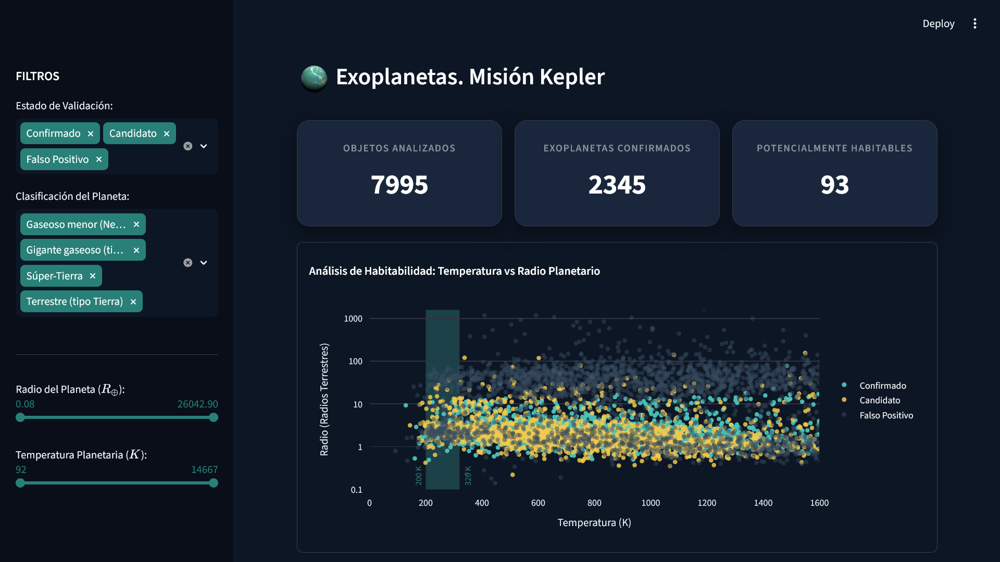
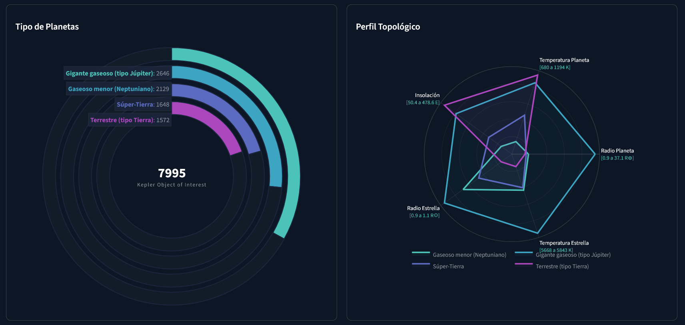

# Kepler Mission Architecture Analytics Dashboard

[](https://kepler-exoplanet-dashboard-31415.streamlit.app/)


## 1. Propósito Estratégico del Proyecto

Este proyecto transforma los activos analíticos brutos de la Misión Kepler de la NASA en un dashboard digital automatizado para toma de decisiones.

El objetivo principal es facilitar la exploración ágil de exoplanetas candidatos, identificar anomalías de habitabilidad y comprender perfiles topológicos planetarios mediante una interfaz visual intuitiva, eliminando la necesidad de interactuar con scripts de código fuente o informes estáticos.

---

## 2. Control de Sesgos Metodológicos y de Muestreo

Las conclusiones estadísticas extraídas de este dashboard deben considerar los siguientes sesgos intrínsecos del método de observación empleado por la Misión Kepler:

* **Sesgo de Selección** (Efecto del Método de Tránsito): Los datos brutos presentan una sobre-representación masiva de exoplanetas con periodos orbitales extremadamente cortos (muy cercanos a su estrella). Esto no refleja la distribución real en el universo, sino la limitación técnica del telescopio Kepler, que detecta con mayor facilidad cuerpos que transitan frecuentemente.
* **Sesgo de Supervivencia y Falsos Positivos**: El dataset contiene un volumen elevado de registros clasificados originalmente como False Positive o Candidate. La gráfica de habitabilidad y la distribución de periodos orbitales están fuertemente condicionadas por objetos que aún no han sido confirmados por observaciones de seguimiento (como velocidad radial o imagen directa). Eliminar o filtrar estos estados distorsiona la distribución real de las observaciones de la misión.
* **Sesgo de Clasificación en el Perfil Topológico**: En el gráfico de radar, variables como el flujo de insolación o la temperatura del planeta se calculan a partir de modelos teóricos de equilibrio térmico de albedo cero. No representan mediciones atmosféricas reales. Por lo tanto, el volumen de planetas etiquetados como "Potencialmente Habitables" es un sesgo de criba preliminar y no implica habitabilidad biológica confirmada.

---

## 3. Origen del Dataset y Glosario de Variables

Los datos utilizados en este proyecto provienen del NASA Exoplanet Archive, operado por el California Institute of Technology (Caltech). En concreto, se trabaja con la tabla acumulativa de Objetos de Interés de Kepler (KOI), que consolida el historial de observaciones del telescopio espacial.

* Fuente Oficial: [Caltech - NASA Exoplanet Archive Cumulative Table](https://exoplanetarchive.ipac.caltech.edu/cgi-bin/TblView/nph-tblView?app=ExoTbls&config=cumulative)
* Volumen de Datos Original: Más de 9,500 observaciones (KOI) y 49 variables astrofísicas y de control.

### Variables Procesadas

| Variable Original | Nombre Ejecutivo | Unidad de Medida &nbsp;&nbsp;&nbsp;&nbsp;&nbsp;&nbsp| Descripción Física |
| :--- | :--- | :--- | :--- |
| kepoi_name | Identificador KOI | Texto alfanumérico | Código único asignado por la NASA al objeto de interés. |
| koi_disposition | Estado de Validación | Categoría | Estado actual del objeto (CONFIRMED -> Confirmado, CANDIDATE -> Candidato, FALSE POSITIVE -> Falso Positivo). |
| koi_period | Periodo Orbital | Días terrestres | Tiempo que tarda el planeta en completar una vuelta alrededor de su estrella. |
| koi_prad | Radio Planetario | Radios Terrestres ($R_\oplus$) | Tamaño del exoplaneta en comparación directa con el tamaño de la Tierra. |
| koi_teq | Temperatura de Equilibrio | Kelvin ($K$) | Temperatura teórica del planeta aproximada por la radiación que recibe de su estrella. |
| koi_insol | Flujo de Insolación | Veces la Tierra ($F_\oplus$) | Cantidad de energía térmica que impacta sobre el planeta en comparación con la Tierra. |
| koi_steff | Temperatura de la Estrella | Kelvin ($K$) | Temperatura efectiva en la superficie de la estrella anfitriona. |
| koi_srad | Radio de la Estrella | Radios Solares ($R_\odot$) | Tamaño de la estrella anfitriona en comparación con nuestro Sol. |
| planet_type | Clasificación | Categoría | Variable calculada por nuestro pipeline para agrupar los planetas por su fisionomía (p. ej., Gigante Gaseoso, Super-Tierra, etc.). |

---

## 4. Análisis Exploratorio (EDA)

Los pasos del análisis exploratorio que estructuraron el diseño final del dashboard fueron:

1. **Integridad y Limpieza Teórica**: El dataset original contenía filas de control nulas en variables críticas de habitabilidad como `koi_teq` y `koi_insol`. El EDA determinó la eliminación de registros incompletos para asegurar que los gráficos de radar e indicadores KPI del dashboard muestren información matemáticamente consistente y verídica.
2. **Feature Engineering (Agrupación Fisiológica)**: A partir de las métricas crudas de radio planetario (koi_prad), el análisis exploratorio segmentó el universo analítico en categorías físicas comprensibles para el negocio (planetas de tamaño rocoso/Tierra, Super-Tierras, Neptunos primarios y Gigantes Gaseosos). Esta columna sintética (planet_type) se convirtió en el filtro categórico princial del dashboard.
3. **Validación de la Muestra Mediante Tablas Dinámicas**: Se cruzaron los flags de falsos positivos de la NASA con la disposición final observada, aislando patrones anómalos de ruido instrumental. Esto permitió diseñar un sistema de filtrado en el frontend que purifica la muestra según el nivel de confianza deseado.

---

## 5. Justificación de la Arquitectura Tecnológica (Streamlit vs. PowerBI / Tableau)
Para el desarrollo de este proyecto estratégico se preseleccionó Streamlit frente a soluciones tradicionales de Business Intelligence como PowerBI o Tableau por las siguientes ventajas:

- **Integración Nativa**: A diferencia de PowerBI/Tableau, que dependen de lenguajes visuales propietarios o DAX limitado, Streamlit permite ejecutar código Python puro. Esto facilita integrar de forma nativa filtrado dinámico mediante Numpy/Pandas y el cálculo de la desviación absoluta respecto a la mediana (MAD) sin necesidad de pasarelas de datos adicionales.
- **Personalización Gráfica**: Los perfiles topológicos complejos (como el gráfico de Radar predictivo o los diagramas de Violín logarítmicos del dashboard) son rígidos, costosos o imposibles de diseñar en PowerBI sin adquirir extensiones de terceros. Streamlit los renderiza mediante objetos nativos de Plotly con control absoluto de cada píxel y propiedad CSS.
- **Control de Versiones y Git Flow Real**: Al ser código fuente puro (.py), el proyecto se puede integrar de forma orgánica en repositorios de Git, permitiendo auditorías de código, ramificaciones funcionales (feature/) y reversiones de estado de software. En PowerBI/Tableau, los archivos son binarios cerrados (.pbix / .twbx), imposibilitando el seguimiento de cambios línea por línea.
- **Eficiencia en Costes de Despliegue e Infraestructura**: Las licencias de servidor corporativo para Tableau o PowerBI Pro/Premium conllevan costes recurrentes por usuario que limitan el consumo demográfico de los datos. Streamlit se despliega de manera gratuita e ilimitada en la nube.

---

## 6. Estructura del Repositorio
El software ha sido diseñado bajo el principio de Separación de Responsabilidades, aislando por completo la lógica matemática y analítica del backend de los componentes de renderizado de la interfaz de usuario:

```text
proyecto-kepler-dashboard/
├── .streamlit/              # Configuración del entorno del servidor de producción
│   └── config.toml          # Estilos globales y variables de entorno del servidor
├── assets/                  # Recursos gráficos e imágenes de marca corporativa
├── data/
│   ├── raw/                 # Dataset original
│   └── processed/           # Dataset limpio final (exoplanets_processed.csv)
├── notebooks/               # Fase de experimentación estadística e investigación
│   └── exoplanets_eda.ipynb # Análisis Exploratorio de Datos
├── src/                     # Backend de la aplicación
│   ├── metrics.py           # Cálculo analítico de estadísticas de radar y KPIs
│   ├── styles.py            # Inyección de CSS y mapas de color
│   └── utils.py             # Helpers técnicos
├── .gitignore              
├── app.py                   # Orquestador principal y punto de entrada frontend (Streamlit)
├── README.md        
└── requirements.txt   
```

## 7. Vista Previa del Dashboard

A continuación se presentan los componentes analíticos clave de la interfaz diseñada para la toma de decisiones:

### Pantalla Principal y Matriz Gráfica
Muestra el control de filtros interactivos en la barra lateral, los KPIs estratégicos en la cabecera con formato de tarjeta y el Scatter Plot con escala logarítmica para el análisis de habitabilidad térmica.



### Análisis de Tipo de Planetas y Perfiles Topológicos
Vista avanzada que permite observar los tipos de planetas y comparar de forma cruzada la composición de los planetas seleccionados mediante geometrías radiales independientes (utilizando desviaciones absolutas respecto a la mediana - MAD).



---

## 8. Instrucciones de Instalación y Ejecución Local

Para replicar este entorno en local, se proponen los siguientes pasos:

### Paso 1: Clonar el Repositorio
```bash
git clone [https://github.com/JCRbit/kepler-exoplanet-dashboard.git](https://github.com/JCRbit/kepler-exoplanet-dashboard.git)
cd proyecto-kepler-dashboard
```

### Paso 2: Configurar el Entorno Virtual (Aislamiento de Dependencias)
```bash
python -m venv venv

# Activación en Windows:
venv\Scripts\activate

# Activación en Mac/Linux:
source venv/bin/activate
```

### Paso 3: Instalar Dependencias del Proyecto
```bash
pip install -r requirements.txt
```

### Paso 4: Lanzar la Aplicación Localmente
```bash
streamlit run app.py
```
